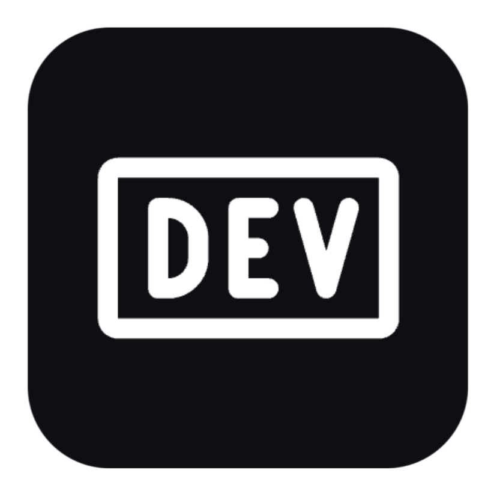

<!-- About Me -->
<h2>About Me</h2>

💻  Aspiring Dev  |  Detail-Oriented

<h2>My Stack</h2>

&nbsp;✺&nbsp;&nbsp;Python 
&nbsp;✺&nbsp;&nbsp;C / C++ 
&nbsp;✺&nbsp;&nbsp;HTML, CSS, JavaScript 
&nbsp;✺&nbsp;&nbsp;Git, GitHub 
&nbsp;✺&nbsp;&nbsp;LM Studio, LLaMA 
&nbsp;✺&nbsp;&nbsp;VS Code

<h2>Focus Areas</h2>

&nbsp;✺&nbsp;&nbsp;AI & Machine Learning 
&nbsp;✺&nbsp;&nbsp;Neural Computing 
&nbsp;✺&nbsp;&nbsp;Scripting & Automation 
&nbsp;✺&nbsp;&nbsp;Web Development 
&nbsp;✺&nbsp;&nbsp;UI/UX & Product Design 
&nbsp;✺&nbsp;&nbsp;Algorithmic Systems

<h2>Get in Touch 💬</h2>

<nobr><a href="https://www.linkedin.com/in/favour-nde-89a52639a?trk=contact-info" style="text-decoration:none; outline:none; border:none;"></a>&nbsp;&nbsp;&nbsp;&nbsp;&nbsp;<a href="mailto:favour7asongwe@icloud.com" style="text-decoration:none; outline:none; border:none;"></a>&nbsp;&nbsp;&nbsp;&nbsp;&nbsp;<a href="https://wa.me/237680567034" style="text-decoration:none; outline:none; border:none;"></a>&nbsp;&nbsp;&nbsp;&nbsp;&nbsp;<a href="https://dev.to/favour7" style="text-decoration:none; outline:none; border:none;"></a>&nbsp;&nbsp;&nbsp;&nbsp;&nbsp;<a href="https://www.snapchat.com/add/qntxlc" style="text-decoration:none; outline:none; border:none;"></a></nobr>

